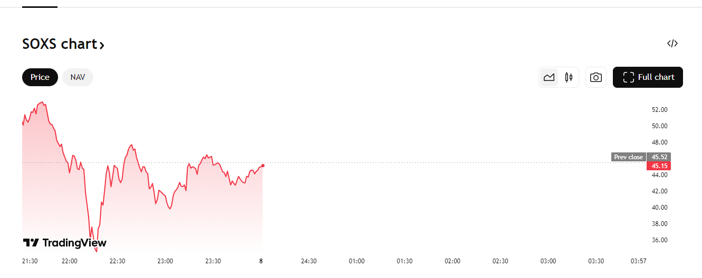

上周末因为特朗普瞎逼逼，关税导致美股暴跌
当时从42点位买入soxs，3倍率做空
周五晚，对应北京时间周六收盘，价格飙涨，至45左右
而华尔街出现了增加银行准备金的要求。
总的来说是巨大利空，赌对了

但是，4月7日，美盘，早盘继续暴跌，市场soxs一度达到53，
但真正开盘时，开局暴跌，然后暴涨
之后一直波动震荡。
我在开局时40点卖出了soxs，是巨大失策。
当然，还好，我是低仓位学习，但总计已亏损200美元。
如果站着说话不腰疼，我可以说我应该在开盘53时就把soxs卖出。

但这不现实，order place后，就面临巨大波动和下跌
但同时，也应该注意到，虽然这是三倍杠杆的锅，30%级别的回撤一定是非理智的
换言之，单只股票上过大的波动极有可能是非理智的

同时，开盘的剧烈波动，应该避免交易。我们可以认为此时的交易非理智，毕竟交易者还在收集信息，很多政策信息还没有出台。
此时陷入恐慌情绪是不理智的。
当然，三倍杠杆加大了这种情绪面。

目前的行情可以说是政策市，但三倍杠杆极大的放大了交易者内心的恐慌，导致日交易上的巨大不确定。
此外，非常可笑的是，市场因为极其渴望好消息面，出现了造谣的行情。
这更说明了开盘行情的不靠谱。
无论怎样，下次交易，应该让子弹再飞一会，等待震荡行情，捡回子弹。

记录操作，后又在ibkr上以46点位购回了soxs，赌的是美国9号对华关税加倍
当日美国已放话说若中国不撤回关税，会增加50%关税
这意味着中美绝对脱钩
不过似乎市场对此反应并不激烈
赌一次9号吧。
至少能确认一点，这种超大级别波动，需要冷静。

此外，这种震荡行情，不应该追高。。。
为何不在回弹低点买？
交易经验实在是太少了，得拿真金白银砸。。

所以，下次应当用更少的资金去摸爬滚打。，不超过500美金。

同时，交易理论，技术分析，支撑位，阻力位，甚至是最基本的k线图都没学
要补课了。

